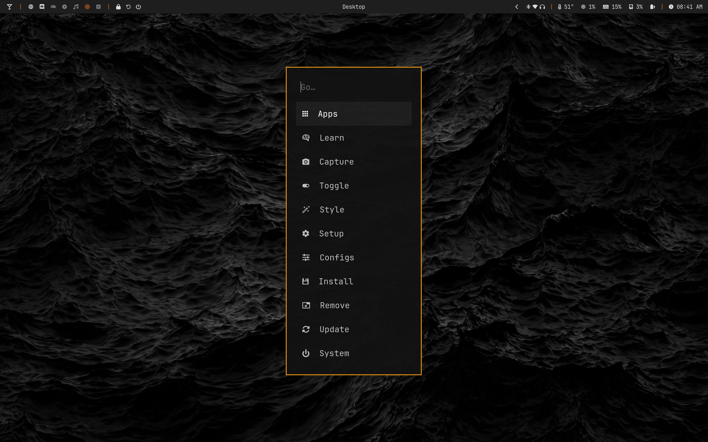
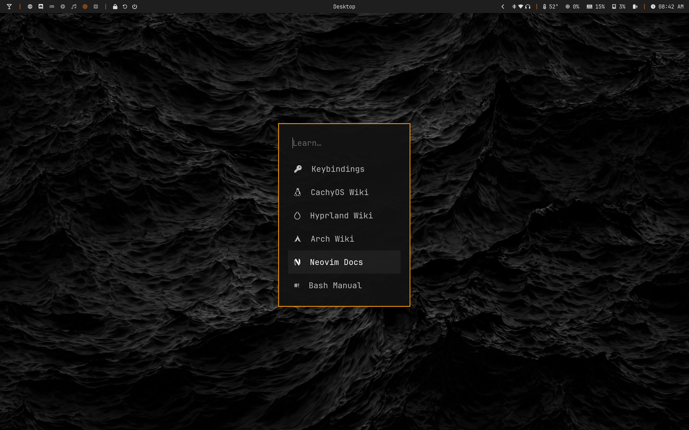
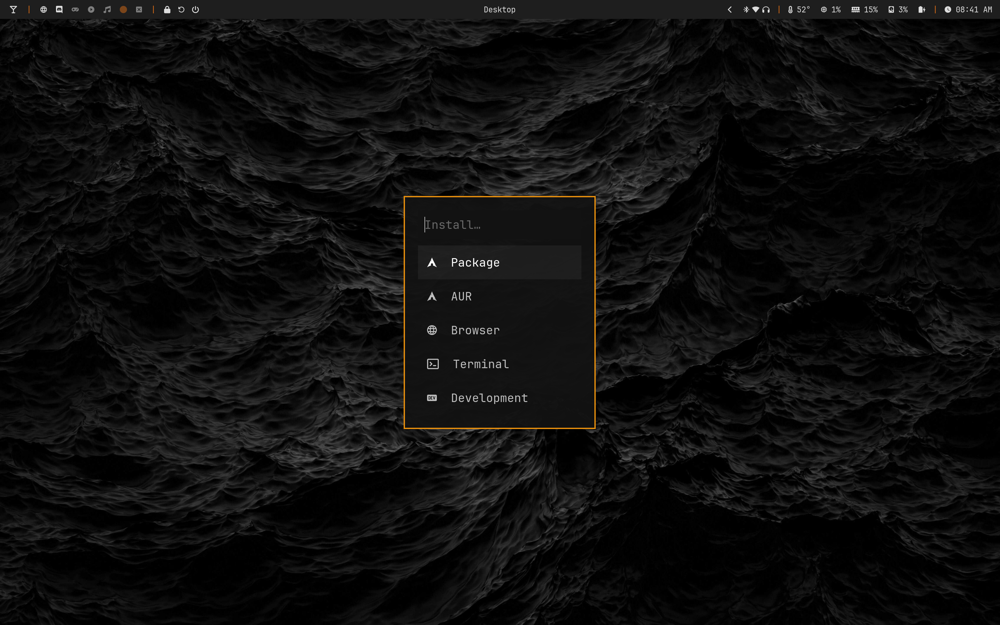
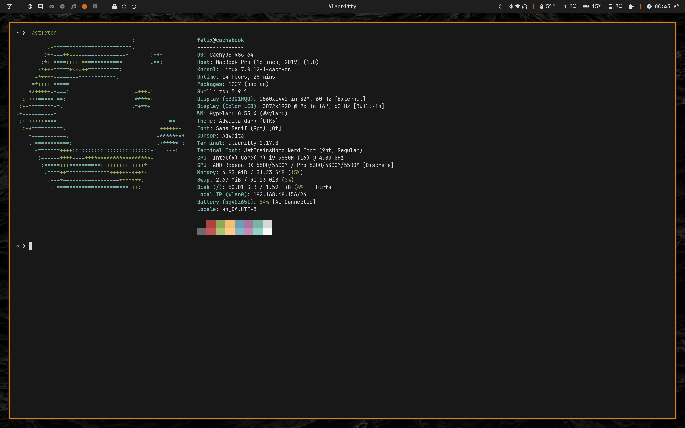
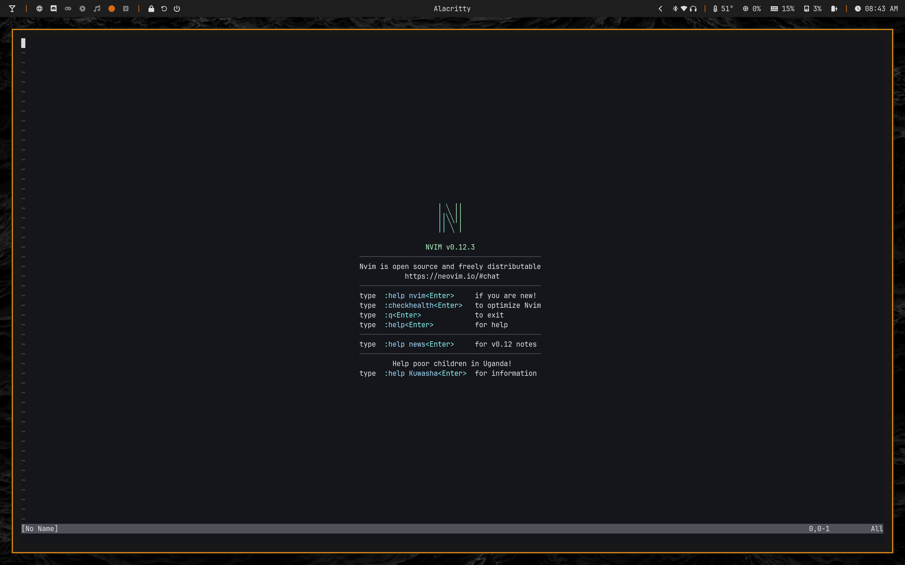
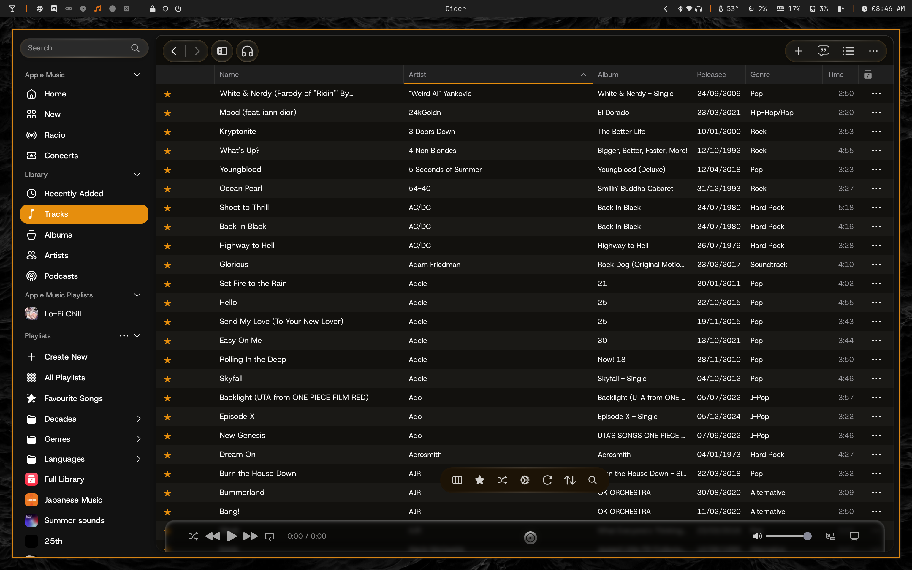

## 🚀 My Dotfiles

[**Screenshots**](#-screenshots) • [**Components**](#-components) • [**Setup**](#-setup)

---

## Preview

<div align="center">

<p><em>Desktop setup with CachyOS + Hyprland set up for T2 MacBook Pro (16-inch, 2019)</em></p>
</div>

## Screenshots

### System Menu






### Terminal (Alacritty)


### Text Editing (Neovim)


### Music Player (Cider)


### Waybar 


### Walker 


## Components

### Window Manager & Desktop
| Component | Description | Config |
|-----------|-------------|--------|
| **[Hyprland](https://github.com/hyprwm/Hyprland)** | Dynamic tiling Wayland compositor | [`hypr/`](./hypr) |
| **[Waybar](https://github.com/Alexays/Waybar)** | Highly customizable Wayland bar | [`waybar/`](./waybar) |
| **[Walker](https://github.com/abenz1267/walker)** | Application launcher and menu | [`walker/`](./walker) |

### Editor & Terminal
| Component | Description | Config |
|-----------|-------------|--------|
| **[Neovim](https://github.com/neovim/neovim)** | Hyperextensible Vim-based text editor | [`none`](./) |
| **[Alacritty](https://github.com/alacritty/alacritty)** | Fast, cross-platform, OpenGL terminal emulator | [`alacritty/`](./alacritty) |

### System Tools
| Component | Description | Config |
|-----------|-------------|--------|
| **[Hyprpaper](https://github.com/hyprwm/hyprpaper)** | Wallpaper manager for Wayland | [`hyprpaper.conf`](./hypr/hyprpaper.conf) |
| **[Hyprlock](https://github.com/hyprwm/hyprlock)** | System Locker | [`hyprlock.conf`](./hypr/hyprlock.conf) |
| **[Hypridle](https://github.com/hyprwm/hypridle)** | Runs Hyprlock when idle | [`hypridle.conf`](./hypr/hypridle.conf) |

## Setup

### Quick Start

```bash
# Clone the repository
git clone https://github.com/username/dotfiles.git ~/.dotfiles
cd ~/.dotfiles

cp * ~/.config -r
```

### Manual Setup (recommended)

```bash
# Clone the repository
git clone https://github.com/username/dotfiles.git ~/.dotfiles

cp -r dotfiles/hypr ~/.config/hypr
cp -r dotfiles/nvim ~/.config/nvim
cp -r dotfiles/walker ~/.config/walker
# ... repeat for other configs
```

</div>
