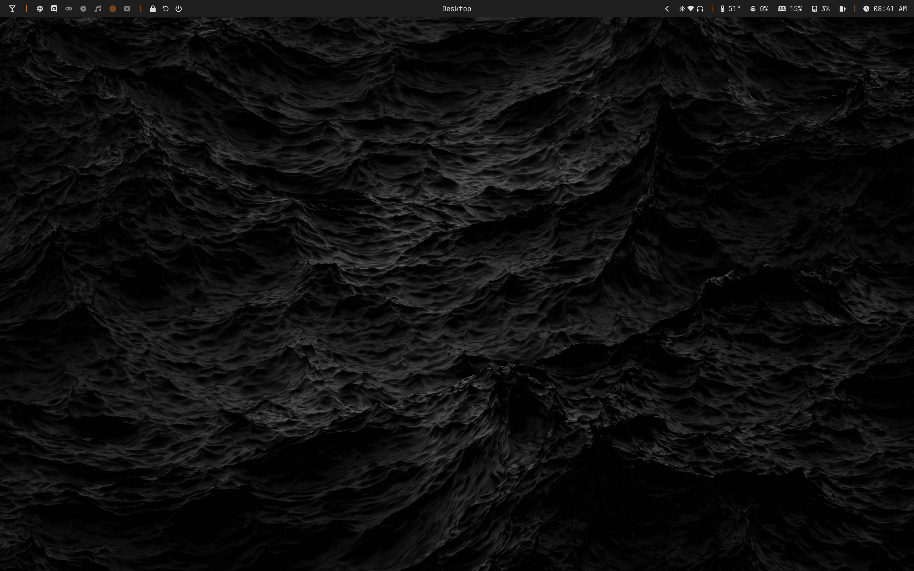
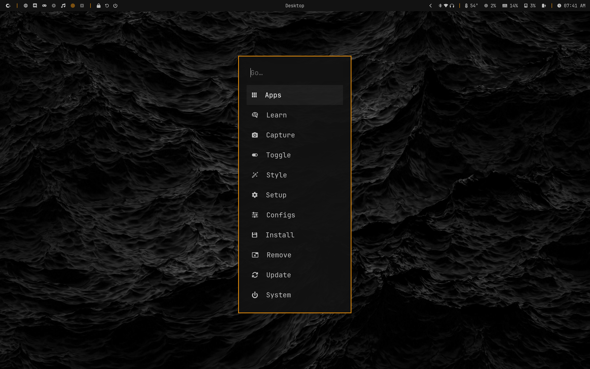
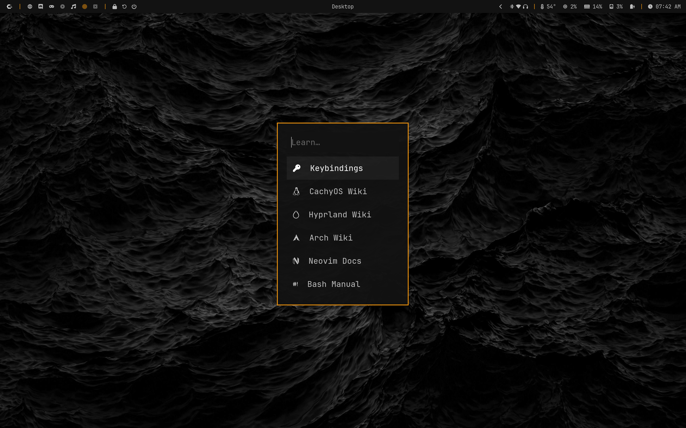
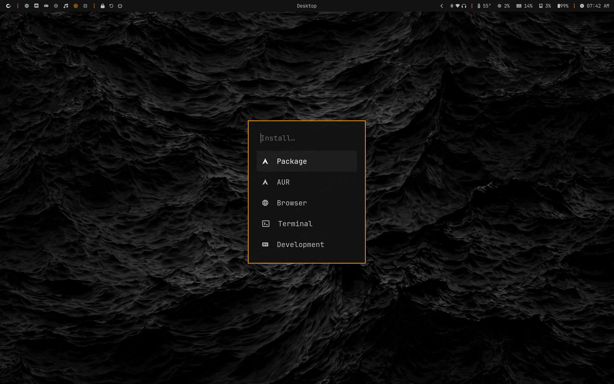
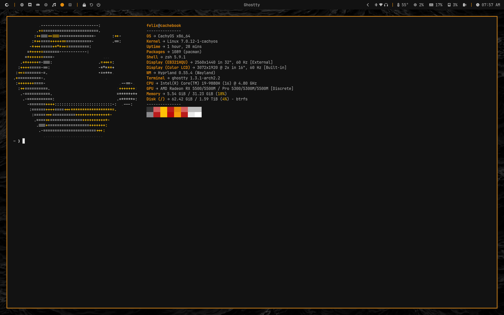
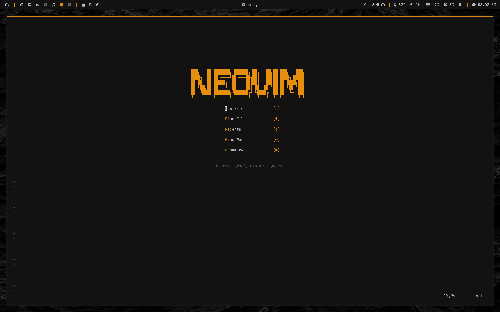
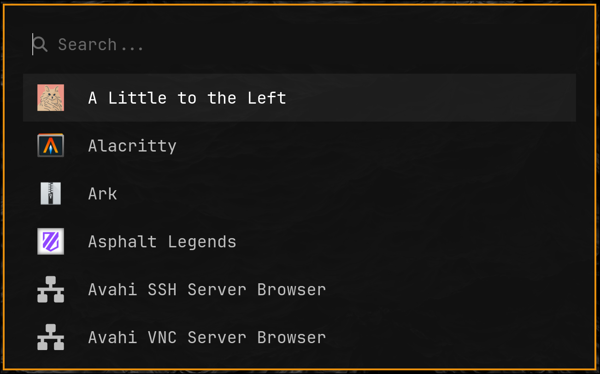
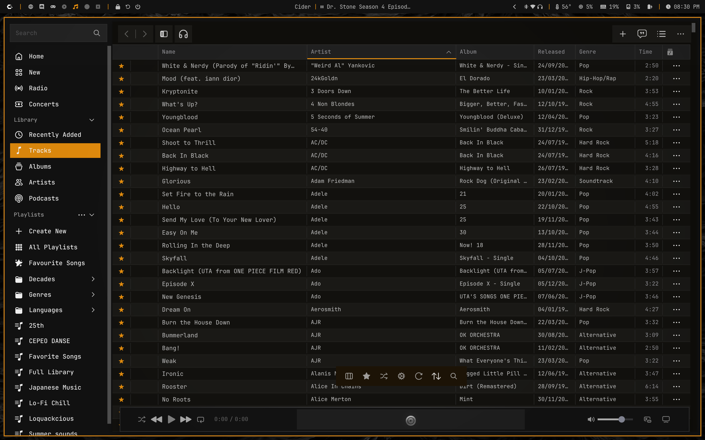

# 🏠 My Dotfiles

[**Screenshots**](#-screenshots) • [**Components**](#-components) • [**Theming**](#-theming) • [**T2 MacBook Notes**](#-t2-macbook-notes) • [**Setup**](#-setup)

---

## 🖼️ Preview

<div align="center">

<p><em>CachyOS + Hyprland on a T2 MacBook Pro (16-inch, 2019)</em></p>
</div>

---

## 📸 Screenshots

### Desktop


### System Menu




### Terminal (Ghostty)


### Text Editing (Neovim)


### Waybar


### Walker


### Cider (Apple Music)


---

## 🧩 Components

### 🪟 Window Manager & Desktop

| Component | Description | Config |
|-----------|-------------|--------|
| **[Hyprland](https://github.com/hyprwm/Hyprland)** | Dynamic tiling Wayland compositor | [`hypr/`](./hypr) |
| **[Waybar](https://github.com/Alexays/Waybar)** | Highly customizable Wayland bar | [`waybar/`](./waybar) |
| **[Walker](https://github.com/abenz1267/walker)** | Application launcher and menu | [`walker/`](./walker) |
| **[Hyprpaper](https://github.com/hyprwm/hyprpaper)** | Wallpaper manager for Wayland | [`hypr/hyprpaper.conf`](./hypr/hyprpaper.conf) |
| **[Hyprlock](https://github.com/hyprwm/hyprlock)** | Screen locker | [`hypr/hyprlock.conf`](./hypr/hyprlock.conf) |
| **[Hypridle](https://github.com/hyprwm/hypridle)** | Idle daemon for Hyprlock | [`hypr/hypridle.conf`](./hypr/hypridle.conf) |
| **[Mako](https://github.com/emersion/mako)** | Notification daemon | [`mako/`](./mako) |
| **[Wlogout](https://github.com/ArtsyMacaw/wlogout)** | Logout menu | [`wlogout/`](./wlogout) |

### ⌨️ Editor & Terminal

| Component | Description | Config |
|-----------|-------------|--------|
| **[Neovim](https://github.com/neovim/neovim)** | Hyperextensible Vim-based text editor | [`nvim/`](./nvim) |
| **[Ghostty](https://github.com/ghostty-org/ghostty)** | Fast, feature-rich terminal emulator | [`ghostty/`](./ghostty) |

### 🔧 System Tools

| Component | Description | Config |
|-----------|-------------|--------|
| **[btop](https://github.com/aristocratos/btop)** | Resource monitor | [`btop/`](./btop) |
| **[Fastfetch](https://github.com/fastfetch-cli/fastfetch)** | System information tool | [`fastfetch/`](./fastfetch) |
| **[cliphist](https://github.com/sentriz/cliphist)** | Clipboard history manager | [`scripts/cliphist-pick`](./scripts/cliphist-pick) |
| **[grimblast](https://github.com/hyprwm/contrib)** | Screenshot tool | — |

---

## 🎨 Theming

All colors are controlled from a single source:

```
~/.config/theme/colors.sh
```

Edit your palette there, then run:

```bash
sync-theme
```

This automatically regenerates and reloads color configs for:
- Hyprland (borders)
- Waybar
- Ghostty
- Mako
- Hyprlock
- Wlogout
- Neovim
- btop
- Fastfetch
- fzf / bat
- Cider (accent color + [Cider-CLI theme](./theme/cider/cider-cli) colors)

Templates live in `~/.config/theme/templates/`. To add a new app, create a template there and add a `render` line to `sync-theme`.

---

## 🍎 T2 MacBook Notes

These dotfiles are built for a **MacBook Pro (16-inch, 2019)** running CachyOS. Several T2-specific workarounds are included:

### Suspend/Resume
Uses [benstaker/T2Linux-Suspend-Fix](https://github.com/benstaker/T2Linux-Suspend-Fix) with custom `t2-suspend.sh` and `t2-resume.sh` scripts that unload/reload `brcmfmac` (WiFi) around suspend. Kernel args in `/boot/limine.conf`:
```
mem_sleep_default=deep pcie_aspm=off intel_iommu=on iommu=pt pcie_ports=compat
```

### Audio
`apple-bce` rebuilt with clang+llvm and the `os_timestamp` patch applied. Config in [`system/`](./system).

### WiFi
Requires T2 WiFi firmware. See [t2linux.org](https://t2linux.org) for setup.

### Displays
- Built-in: `eDP-1` — 3072x1920 @ 2x HiDPI
- External: `DP-2` — 2560x1440

---

## 🚀 Setup

> **Note:** These dotfiles are personal and built around specific hardware. Manual setup is recommended — don't blindly copy everything.

### 📦 Dependencies

```bash
yay -S hyprland waybar-git walker-bin ghostty neovim \
        mako wlogout hyprpaper hyprlock hypridle \
        grimblast-git cliphist wl-clipboard \
        btop fastfetch fzf bat satty \
        ttf-jetbrains-mono-nerd
```

### 📋 Manual Setup (recommended)

```bash
# Clone the repo
git clone https://github.com/fellow-11/dotfiles.git ~/dotfiles

# Copy configs you want
cp -r ~/dotfiles/hypr ~/.config/hypr
cp -r ~/dotfiles/waybar ~/.config/waybar
cp -r ~/dotfiles/ghostty ~/.config/ghostty
cp -r ~/dotfiles/nvim ~/.config/nvim
cp -r ~/dotfiles/walker ~/.config/walker
cp -r ~/dotfiles/mako ~/.config/mako
cp -r ~/dotfiles/theme ~/.config/theme

# Install sync-theme
cp ~/dotfiles/scripts/sync-theme ~/.local/bin/sync-theme
chmod +x ~/.local/bin/sync-theme

# Apply theme
sync-theme
```
> **Note:** `scripts/sync-theme` contains a hardcoded Cider config path (`~/.config/sh.cider.genten/spa-config.yml`). Remove or adjust that block if you don't use Cider.

### 💾 Dotfiles Management

```bash
# Save local changes to repo
dotfiles-save

# Pull remote changes (e.g. after editing README on GitHub)
dotfiles-sync
```
